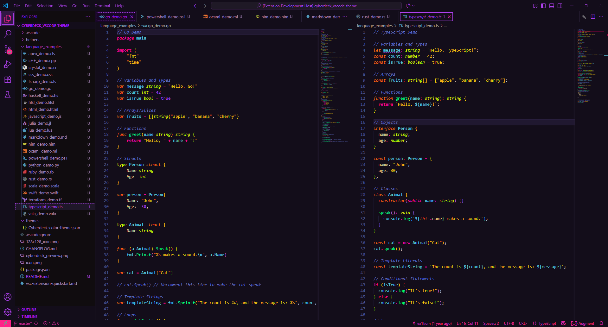

# Cyberdeck 2025 🌃

> *A neo-retro-futuristic neural interface for the modern code cowboy.*

[](https://marketplace.visualstudio.com/items?itemName=ex1tium.cyberdeck-2025)
[](https://marketplace.visualstudio.com/items?itemName=ex1tium.cyberdeck-2025)
[](https://marketplace.visualstudio.com/items?itemName=ex1tium.cyberdeck-2025)
[](LICENSE)

**Cyberdeck 2025** is a cyberpunk-inspired dark theme for Visual Studio Code featuring deep purple backgrounds, vibrant neon accents, and comprehensive syntax highlighting. Designed for developers who want an immersive, high-contrast coding experience with modern semantic highlighting support.

---

## ✨ Features

### 🎨 Cyberpunk Aesthetic
- **Deep purple-black backgrounds** (`#130d1a`) for reduced eye strain
- **Vibrant neon accents** in hot pink, cyan, and neon green
- **High contrast** color scheme
- **Consistent visual language** across editor, UI, and terminal

### 🚀 Modern Highlighting System
- **Semantic Highlighting**: Context-aware intelligent coloring using language servers
- **TextMate Grammar**: Comprehensive fallback for many languages
- **Dual System Support**: Works perfectly with or without language servers

### 💎 First-Class Language Support

#### TypeScript/JavaScript
- Distinct colors for types, interfaces, enums, and type parameters
- Clear differentiation between variables, functions, and classes
- Styled decorators and JSX/TSX support

#### Rust
- Complete coverage for lifetimes, macros, and traits
- Ownership keywords highlighted distinctly
- Macro invocations and attributes styled

#### Go
- Goroutines and channels clearly marked
- Interface and struct highlighting
- Go-specific syntax support

#### Python
- Decorators and magic methods styled
- Type hints and annotations
- Python 3.x features supported

#### Java
- Annotations and generics
- Lambda expressions
- Modern Java syntax

### 🎯 Additional Features
- **25+ Languages Supported**: C/C++, C#, PHP, Ruby, HTML/CSS, JSON, Markdown, and more
- **Git Integration**: Clear visual indicators for changes
- **Terminal Colors**: Custom ANSI palette matching the theme
- **Bracket Pairs**: Styled bracket pair colorization
- **Inline Hints**: Themed parameter hints and type annotations
- **Modern UI**: Support for Command Center, Chat, Sticky Scroll, and more

---

## 📸 Screenshots

### Cyberdeck 2025 Theme Preview

*Experience the retro-futuristic cyberpunk aesthetic with deep purple backgrounds, vibrant neon accents, and comprehensive syntax highlighting*

---

## 🚀 Installation

### From VS Code Marketplace

1. Open **Extensions** sidebar (`Ctrl+Shift+X` / `Cmd+Shift+X`)
2. Search for **"Cyberdeck 2025"**
3. Click **Install**
4. Click **Set Color Theme** or:
   - Open Command Palette (`Ctrl+Shift+P` / `Cmd+Shift+P`)
   - Type **"Color Theme"**
   - Select **"Cyberdeck 2025"**

### From VSIX File

```bash
code --install-extension cyberdeck-2025-1.0.0.vsix
```

### Manual Installation

1. Download the latest release from [GitHub Releases](https://github.com/ex1tium/cyberdeck-2025_vscode_theme/releases)
2. Extract to your VS Code extensions folder:
   - **Windows**: `%USERPROFILE%\.vscode\extensions`
   - **macOS/Linux**: `~/.vscode/extensions`
3. Install extension from location in VS Code
4. Reload VS Code

---

## 🎨 Color Palette

### Core Colors

| Color | Hex | Usage |
|-------|-----|-------|
| Deep Purple Black | `#130d1a` | Editor background |
| Warm Off-White | `#ded2cd` | Primary text |
| Vibrant Purple | `#b141f1` | Errors, numbers, accents |
| Hot Pink | `#ff2289` | Keywords, constants |
| Cyan | `#58c7e0` | Variables, identifiers |
| Neon Green | `#00ff88` | Functions, methods |
| Lime Green | `#d6fc00` | Types, classes |
| Golden Yellow | `#f9c80e` | Strings, literals |
| Blue-Purple | `#6071cc` | Comments (italic) |

### Full Palette

See [docs/COLOR_PALETTE.md](docs/COLOR_PALETTE.md) for the complete color reference with RGB values, usage guidelines, and accessibility notes.

---

## 🔧 Recommended Settings

For the best experience with Cyberdeck 2025:

```json
{
  // Enable semantic highlighting
  "editor.semanticHighlighting.enabled": true,

  // Enable bracket pair colorization
  "editor.bracketPairColorization.enabled": true,
  "editor.guides.bracketPairs": "active",

  // Font recommendations
  "editor.fontFamily": "'Fira Code', 'JetBrains Mono', 'Cascadia Code', Consolas, monospace",
  "editor.fontLigatures": true,
  "editor.fontSize": 14,
  "editor.lineHeight": 1.6,

  // Cursor style
  "editor.cursorBlinking": "smooth",
  "editor.cursorSmoothCaretAnimation": "on",

  // Minimap
  "editor.minimap.enabled": true,
  "editor.minimap.renderCharacters": false,

  // Terminal
  "terminal.integrated.fontFamily": "'Fira Code', 'JetBrains Mono', monospace",
  "terminal.integrated.fontSize": 13
}
```

### Recommended Font

**Fira Code** or **JetBrains Mono** work beautifully with this theme:
- [Fira Code](https://github.com/tonsky/FiraCode)
- [JetBrains Mono](https://www.jetbrains.com/lp/mono/)
- [Cascadia Code](https://github.com/microsoft/cascadia-code)

---

## 🎯 Language Support

### Fully Tested & Optimized
- ✅ TypeScript / JavaScript / JSX / TSX
- ✅ Rust
- ✅ Go
- ✅ Python
- ✅ Java
- ✅ C / C++
- ✅ C#
- ✅ HTML / CSS / SCSS / LESS
- ✅ JSON / JSONC / YAML / TOML
- ✅ Markdown
- ✅ Shell / Bash / Zsh

### Additional Support
PHP, Ruby, Swift, Kotlin, Dart, Elixir, Haskell, Lua, SQL, GraphQL, and many more!

---

## 📝 License

This theme is licensed under the [MIT License](LICENSE).

---


## 🔗 Links

- [GitHub Repository](https://github.com/ex1tium/cyberdeck-2025_vscode_theme)
- [VS Code Marketplace](https://marketplace.visualstudio.com/items?itemName=ex1tium.cyberdeck-2025)
- [Open VSX Registry](https://open-vsx.org/extension/ex1tium/cyberdeck-2025)
- [Issue Tracker](https://github.com/ex1tium/cyberdeck-2025_vscode_theme/issues)
- [Changelog](CHANGELOG.md)

---

<div align="center">

**[Install Now](https://marketplace.visualstudio.com/items?itemName=ex1tium.cyberdeck-2025)** | **[View Source](https://github.com/ex1tium/cyberdeck-2025_vscode_theme)** | **[Report Issue](https://github.com/ex1tium/cyberdeck-2025_vscode_theme/issues)**

*Made with 💜 for developers who code in style*

</div>
